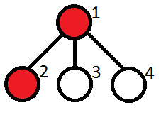

**Задача 1.**  (**LevelAverage)**

На входа се подават елементи на двуично наредено дърво в реда на тяхното добавяне. За това дърво трябва да изведете средно аритметичната стойност на елементите от всяко ниво.

Забележка: При добавяне на елементи, ако даден елемент вече съществува в дървото, новото срещане да се добави в дясното поддърво.

**Input Format**

На първия ред се подава число - брой възли в дървото

На втория ред се подават елементите на дървото в реда на тяхното добавяне.

**Constraints**

1 ≤ N ≤ 500000

|ai| ≤ 2^16 (0 ≤ i < N)

**Output Format**

На всеки нов ред изведете средно аритметичната стойност на дадено ниво, започвайки от корена. Форматирането е точно 2 цифри след десетичната точка.

**Sample Input 0**

6

5 1 6 0 4 7

**Sample Output 0**

5.00

3.50

3.67

**Explanation 0**

        5

       / \

      1   6

     /\   \

    0   4   7

5 / 1 = 5.00

(1 + 6) / 2 = 3.50

(0 + 4 + 7) / 3 = 3.67

**Задача 2. (BrandNew)**

Ваш колега Дидо си е купил нов Macbook Pro с i7! На втория ден обаче ESC клавишът му се прецаква и трябва да ходи на сервиз. Дидо живее в странен квартал. Кварталът има формата на кореново дърво с номерирани възли от 1 до N и N - 1 ребра между тях. Къщата на Дидо се намира във възел 1, който е корена на това дърво, а сервизите се намират в листата. За съжаление, Дидо е изфукал всичките си пари за новия лаптоп и не иска да минава покрай някой друг Starbucks, за да не се изкуши и да изхарчи още. Той не може да ходи до даден сервиз, ако по пътя има повече от M последователни Starbucks кафета.

Вашата задача е да преброите до колко сервиза Дидо може да стигне.

**Input Format**

На първия ред са подадени 2 числа:

N (брой възли в дървото), М (максимумът последователни кафета, които няма да изкушат Дидо)

На втория ред са N числа:

ai е 0 или 1, в зависимост от това дали има кафе във възел i

Следват N-1 реда във формат i j, които са ненасочени ребра в дървото (1 ≤  i, j ≤  N, i ≠ j).

Tip: не е задължително i и j да са вече видяни върхове. Например, на ред 3 може да ви е подадено реброто 8 13

**Constraints**

2 ≤ N≤ 10^5

1 ≤ M ≤ N

**Output Format**

Брой сервизи, до които Дидо може да стигне. (без нов ред)

**Sample Input 0**

4 1

1 1 0 0

1 2

1 3

1 4

**Sample Output 0**

2

**Explanation 0**

Дидо може да ходи до сервизите в листата 3 и 4.
