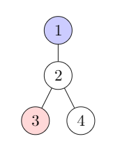
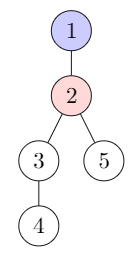

**Задача 1.** **(PairsG4G)**

Имате магически масив от числа, този масив може да го разбивате по ваш избор на групи от по 1 елемент или от по 2 елемента. Например: [2,3,4] => може да го разбиете на (2,3),(4) или (2),(3),(4) или (2,4),(3) и т.н

Знае се също че след крайното разбиване на групи, умножаваме всички елементи които са в една група и накрая сумираме произведенията на групите. Например: имаме масив [2,3,4] ако разбием масива на (2,3), 4, то получаваме (2\*3),(4) => 6 + 4 => 10

Ако разбием масива на (2),(3),(4) то получаваме 2 + 3 + 4 => 9

Може би забелязвате че при различни видове групиране получавате понякога различен отговор, това което се иска от вас е да върнете максималната сума на групи която може да се получи ако използваме оптимална стратегия на групиране.

**Input Format**

На вход ще получите число T - брой на тестовете

За всеки тест на нов ред ще получите число N ( размер на масива ), следват N числа разделени с интервал.

**Constraints**

1. Броят на тестовете е <= 200
2. Ограничения: N <= 63
3. Всяко число е между -2222 и 2222 включително.

**Output Format**

За всеки тест да се изведе максималната сума която може да получите чрез оптимално групиране

**Sample Input 0**

2

5

3 4 5 2 1

3

3 2 1

**Sample Output 0**

27

7

**Explanation 0**

За тест #1: Оптималната стратегия е: 1 + (2*3) + (4*5) => 27

За тест #2: Оптималната стратегия е: 1 + (2*3) => 7

**Задача 2.** **(Anagram)**

[Long Story - Short] Aнаграма е дума или фраза, образувана от буквите на друга дума или фраза чрез пермутация.

Пример: бира = риба.

Тоест, ако имате думи A и B и може да пренаредите по такъв начин буквите на думата A че да получите B, то A и B са анаграми.

Може да забележите че ако думите A и B имат различна дължина, те никога не са анаграми помежду си.

Жоро Гийкса4Гийкса много обича да си играе с двойки думи които имат една и съща дължина. Защо обича да са с една и съща дължина, защото има шанс тази двойка думи да са анаграми. Но понякога дори и 2 думи да са с еднаква дължина те може да не са анаграми помежду си ( тоест ако пренаредим буквите на първата дума може да не получим втората). Натъжен от този факт, Жоро поискал съвет от феята СъдебноСпорна Цветанова. Тя му казала: '**Може да си избереш която и да е буква от първата дума и да я замениш със следващата в азбуката ( a->b, d->e и т.н ) **'

**Жоро ако има думите "ab" и "bb", то те в началото не са анаграми, но с помоща на Цветанова, той може да избере да замени първата буква от 'ab' със следващата и да получи 'bb' и така вече да има анаграми. Важно е да се отбележи че избора е 'Цикличен' ако реши да замени 'z' със следващата тя ще стане на 'a'.**

Нещо повече Цветанова била толкова щедра, че казала на Жоро че може да използва прозволен брой пъти горе описаният трик върху които си избере букви, така гарантирано винаги може да направи двете думи да са анаграми спрямо една друга. Единствено трябва да заплати такса от 1 лев при всяко извикване на трансформацията, от вас се иска да помогнете на Жоро и да върнете минималният брой пари които Жоро ще похарчи при оптимална стратегия за извикване на магия  **върху буквите на първата дума**  определен брой пъти, така че двете думи да са анаграми.

**Input Format**

На входа получавате число T, следват T теста

За всеки тест получавате по 2 думи всяка на отделен ред,  **гарантирано е че двете думи са с еднаква дължина и винаги може A да се направи анаграма на B.**

**Constraints**

Брой на тестовете <= 100

Дължината на всяка дума >=1

Дължината на всяка дума <=200

**Азбуката на думите ще е 'A'-'Z'.**

**Output Format**

За всеки тест на нов ред изведете минималната сума която Жоро ще трябва да заплати, за да превърна A в анаграма на B.

**Sample Input 0**

1

AAAA

ABBA

**Sample Output 0**

2

**Explanation 0**

Прави се трансформация върху A[AA]A по 1 път и получава ABBA

**Sample Input 1**

1

ABAA

AAAB

**Sample Output 1**

0

**Explanation 1**

Думите вече са анаграми една друга.

**Задача 3.** **()**

Даден е израз в [Полски запис](https://www.hackerrank.com/external_redirect?to=https://bg.wikipedia.org/wiki/%D0%9F%D0%BE%D0%BB%D1%81%D0%BA%D0%B8_%D0%B7%D0%B0%D0%BF%D0%B8%D1%81) (aka префиксен запис), съдържащ символите &#39;+&#39;, &#39;-&#39; и &#39;?&#39;. Вашата задача е на мястото на всеки &#39;?&#39; да поставите положително число, така че стойността на израза да е нула. Също така, стойността на най-голямото число да е минимално. Ако има няколко решения, няма значение кое ще изведете на стандартния изход.

**Input Format**

На единствен ред ще бъде подаден израз, съдържащ '+', '-' и '?'. Изразът винаги ще е коректен.

**Constraints**

3 ≦дължинанаизраза≦ 10^6

**Output Format**

На отделен ред изведете търсените числа.

**Sample Input 0**

-?-??

**Sample Output 0**

1

2

1

**Explanation 0**
```
   -

  / \

 ?   -

    / \

   ?   ?
```
Инфиксния запис на израза е ?-(?-?).

Търсените числа са 1, 2, 1: 1-(2-1) = 0

**Sample Input 1**

+-??+-???

**Sample Output 1**

1

1

1

2

1

**Explanation 1**
```
       +

     /   \

    -     +

   /\   / \

  ?   ?-   ?

       / \

      ?   ?
```
Инфиксен запис: (? - ?) + ((? - ?) + ?)

Решения са:

- 1 2 1 1 1
- 1 1 1 2 1

**Задача 4.** **()**

В столицата на Алгоритмия освен пътуването с влак, дригият предпочитан превоз е с такси. За съжаление обаче таксиметровите шофьори имат начин да препечелват повече, като карат в кръг и удължават разстоянието, което преминават. Това разбира се не се харесва на гражданите и те искат от кмета да реши този проблем. Кмета има брилянтната идея да промени посоката на някои от пътищата(за целите на тази задача те са еднопосочни). Той разбира се не знае как да реши тази задача и вие трябва да му помогнете. По даден граф, чиито възли съответстват на кръстовищата, а ребрата на пътни сегменти между кръстовищата, вашата задача е да промените посоките на пътните сегменти по такъв начин, че да няма начин таксиметровите шофьори да карат в кръг(тоест да няма цикъл в графа). Тъй като тази задача е прекалено лесна, то кмета иска от вас дължината на най-дългият сегмент на който променяте дължината да е минимална.

**Input Format**

На първия ред за зададени числата n и m - броят на кръстовищата и пътните сегменти. На всеки от следващите m реда е зададена тройката u v w съответсваща на сегмент свързващ кръстовище u с кръстовище v и имащ дължина w. Кръстовищата са номерирани с числата от 1 до n.

**Constraints**

1 <= n, m <= 10^5

**Output Format**

На единствен ред изведете минималната дължина на най-дългият пътен сегмент, на който сменята посоката, така че в резултатния граф да няма цикъл. Ако в началния граф няма цикъл изведете 0.

**Sample Input 0**

5 6

2 1 1

5 2 6

2 3 2

3 4 3

4 5 5

1 5 4

**Sample Output 0**

2

**Sample Input 1**

5 7

2 1 5

3 2 3

1 3 3

2 4 1

4 3 5

5 4 1

1 5 3

**Sample Output 1**

3

**Задача 5.** **()**

Алекс и Иван обичат да играят на следната игра - игралното поле се състои от кореново дърво с n върха(номерирани с числата от 1 до n, като корена е номериран с 1). Всеки връх на дървото е игрална позиция, като Алекс започва играта от корена на дървото, а Иван от даден връх x различен от корена. Първи на ход е Иван, който има право да остане на същата позиция или да се премести в някой от съседните върхове. След това Алекс има право на същия ход и т.н. двамата се редуват. Играта свършва тогава когато Алекс застане на същата позиция, на която в момента е Иван. Разбира се Алекс би искала играта да приключи възможно най-бързо, а Иван би искал точно обратното - да удължи играта възможно най-много. Вашата задача е по даденото игрално поле и началната позиция на Иван да намерите колко хода ще продължи играта, ако Алекс и Иван играят оптимално.

**Input Format**

На първия ред са зададени числата n и x съответстващи на броя на върховете в кореновото дърво и началната позиция на Иван. Следват n - 1 реда, които се състоят от числата u и v съответстващи на ребро в дървото между върховете u и v.

**Constraints**

2 <= n <= 10^5

2 <= x <= n

**Output Format**

На единствен ред изведете броя ходове на играта при условие, че и двамата играят оптимално.

**Sample Input 0**

4 3

1 2

2 3

2 4

**Sample Output 0**

4

**Explanation 0**


 
Иван : Остава на позиция 3

Алекс : Премества се на позиция 2

Иван : Остава на позиция 3

Алекс : Премества се на позиция 3

**Sample Input 1**

5 2

1 2

2 3

3 4

2 5

**Sample Output 1**

6

**Explanation 1**



Иван : Премества се на позиция 3

Алекс : Премества се на позиция 2

Иван : Премества се на позиция 4

Алекс : Премества се на позиция 3

Иван : Остава на позиция 4

Алекс : Премества се на позиция 4
